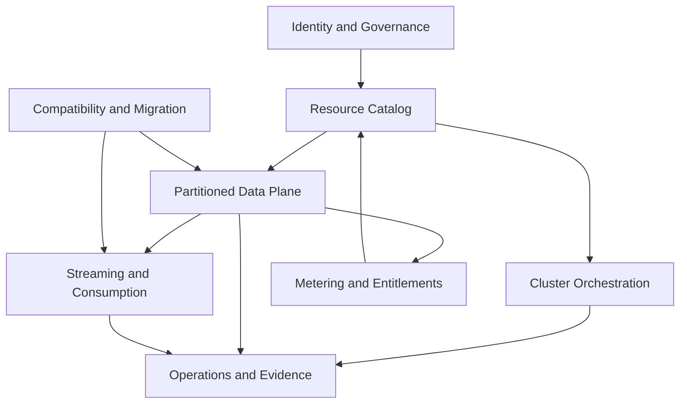
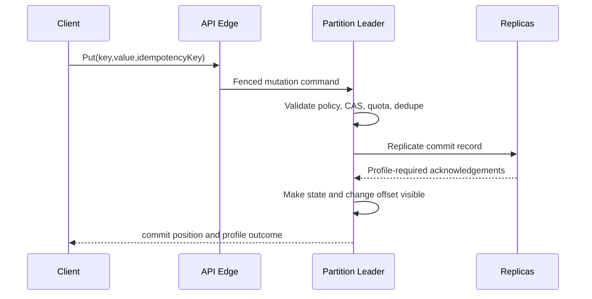

# Domain-Driven Design

**Version:** 0.1 · **Status:** Proposed · **Date:** 2026-09-24

Related: [BRD](BUSINESS_REQUIREMENTS.md) · [TRD](TECHNICAL_REQUIREMENTS.md) · [Validation](TRACEABILITY_AND_VALIDATION.md)

## 1. Ubiquitous language

- **Tenant:** security and commercial isolation boundary.
- **Project:** grouping for clusters and namespaces.
- **Cluster:** managed set of nodes running a compatible release.
- **Namespace:** policy and API boundary for keys and/or streams.
- **Workload profile:** named guarantee contract such as `cache` or `durable`.
- **Partition:** unit of ordering, placement, replication, recovery, and atomic mutation.
- **Epoch:** monotonically increasing ownership generation used for fencing.
- **Commit position:** durable ordered position inside a partition.
- **Change record:** ordered event committed with a state mutation.
- **Operation:** auditable long-running control-plane workflow.
- **Evidence:** immutable reference to a test, backup, restore, benchmark, or operational result.

## 2. Bounded contexts



### Identity and Governance

Owns Tenant, Principal, Role, Policy, CredentialReference, AuditEvent, retention and residency policy. It does not own cluster topology or data-plane records.

### Resource Catalog

Owns Project, ClusterSpec, NamespaceSpec, WorkloadProfileVersion, ReleaseChannel, desired/observed state references. It is the source of desired configuration, not runtime truth.

### Cluster Orchestration

Owns NodeRegistration, PlacementPlan, PartitionAssignment, UpgradePlan, RebalancePlan, BackupPlan, RestorePlan, and Operation. It consumes health/capacity facts and produces fenced commands.

### Partitioned Data Plane

Owns PartitionReplica, PartitionEpoch, KeyRecord, Version, Mutation, CommitRecord, Segment, Checkpoint, and ReplicaProgress. It is authoritative for committed state and positions.

### Streaming and Consumption

Owns StreamView, ChangeRecord, ConsumerGroup, GroupMember, LeaseGeneration, and OffsetCommit. It cannot alter committed partition history.

### Compatibility and Migration

Owns CompatibilityProfile, FeatureRule, MigrationAssessment, ShadowRun, ReconciliationReport, CutoverPlan, and RollbackPoint. Anti-corruption layers translate external commands without leaking their models into the native domain.

### Operations and Evidence

Owns HealthAssessment, Incident, RunbookExecution, BenchmarkRun, RestoreExercise, CompatibilityRun, and EvidenceArtifact. It does not infer “healthy” when required signals are absent.

### Metering and Entitlements

Owns MeterDefinition, UsageRecord, Allocation, Budget, Entitlement, and Reconciliation. Usage facts are append-only and versioned.

## 3. Aggregates and invariants

### Namespace aggregate

Root: `Namespace`

- References one immutable `WorkloadProfileVersion`.
- Policy changes are planned operations, never in-place semantic mutation.
- Limits must be positive and within cluster capability.
- Deletion enters a tombstoned lifecycle and requires export/retention handling.

### Partition aggregate

Root: `Partition`

- One active epoch; only its fenced leader may propose writes.
- Commit positions are monotonic and gap rules are format-defined.
- A committed mutation and enabled change record share one commit record.
- Replica progress cannot exceed the authoritative committed position.
- Serving readiness requires format, manifest, checksum, epoch, and policy validation.

### Consumer group aggregate

Root: `ConsumerGroup`

- Assignments belong to one lease generation.
- Stale members cannot commit offsets.
- Committed offset cannot move backward unless an explicit, authorized reset operation is recorded.

### Operation aggregate

Root: `Operation`

States: `planned -> approved -> running -> verifying -> succeeded|failed|cancelled|rolled_back`.

- The request and resolved target set are immutable after approval.
- Steps are idempotent and record attempts.
- Success requires verification evidence; command acceptance alone is insufficient.
- Cancellation and rollback availability are explicit per phase.

### Compatibility profile aggregate

- Names external product/protocol and version range.
- Every feature is `supported`, `supported_with_difference`, `unsupported`, or `untested`.
- `supported` requires executable evidence for normal, error, retry, and recovery semantics.

## 4. Domain services

- `PlacementPlanner`: produces constraint-checked assignments from topology and capacity.
- `PolicyAdmissionService`: proves cluster capabilities satisfy a namespace profile before activation.
- `MutationCoordinator`: validates fencing/idempotency and creates partition commit proposals.
- `RecoveryVerifier`: validates lineage, checksum, positions, and profile prerequisites.
- `MigrationAnalyzer`: compares observed source usage with a compatibility profile.
- `HealthEvaluator`: applies versioned rules and returns healthy/degraded/unknown with evidence.
- `CostEstimator`: applies versioned meter definitions to a proposed topology/workload.

## 5. Domain events

Canonical envelope fields: `event_id`, `event_type`, `schema_version`, `occurred_at`, `tenant_id`, `correlation_id`, `causation_id`, `producer`, `subject`, `payload`, and integrity metadata.

Key events:

- `NamespaceProvisioningRequested`, `NamespaceActivated`, `NamespacePolicyChangeRejected`
- `PartitionEpochAdvanced`, `ReplicaUnderReplicated`, `PartitionRecovered`
- `MutationCommitted`, `ChangeRecordPublished`, `MutationDeduplicated`
- `ConsumerAssignmentChanged`, `ConsumerOffsetCommitted`
- `RebalancePlanned`, `RebalanceCompleted`, `UpgradeVerificationFailed`
- `BackupCompleted`, `RestoreVerified`, `EvidenceRecorded`
- `CompatibilityDifferenceDetected`, `CutoverAuthorized`, `RollbackInitiated`
- `BudgetThresholdCrossed`, `UsageReconciled`

Events are facts in past tense. Requests/commands are not recorded as successful outcomes.

## 6. Principal workflows

### Partition-local mutation with change record



### Scale-out saga

1. Observe capacity pressure and create a proposal.
2. Validate topology, budget, version compatibility, and failure-domain constraints.
3. Approve an immutable placement plan.
4. Add nodes and transfer checkpointed partitions.
5. Catch up incremental records.
6. Advance epochs and route traffic.
7. Verify replication, latency, and policy compliance.
8. Commit or roll back while rollback is safe; retain evidence.

### Migration saga

Inventory -> compatibility assessment -> shadow traffic -> reconciliation -> cutover approval -> bounded cutover -> verification -> rollback-window close. Any `untested` feature blocks automated approval.

## 7. Integration contracts

- Control commands carry operation ID, expected resource version, fencing token, deadline, and idempotency key.
- Data responses carry partition/epoch/commit metadata where relevant.
- External adapters translate into native commands and map native errors explicitly.
- Object storage integrations use immutable object keys, checksums, manifests, server-side encryption, and least-privilege credentials.
- Telemetry exporters are lossy/non-authoritative; audit and usage pipelines use durable handoff.

## 8. Code organization guidance

```text
cmd/
internal/
  governance/
  catalog/
  orchestration/
  partition/
  streaming/
  compatibility/
  evidence/
  metering/
api/
  native/v1/
  admin/v1/
adapters/
  redis/
  kafka/
deploy/
test/
  fault/
  compatibility/
  benchmark/
```

Domain packages must not import protocol, database-driver, UI, or cloud-provider packages. Adapters depend inward on application ports. Cross-context workflows use versioned commands/events rather than shared mutable tables.
