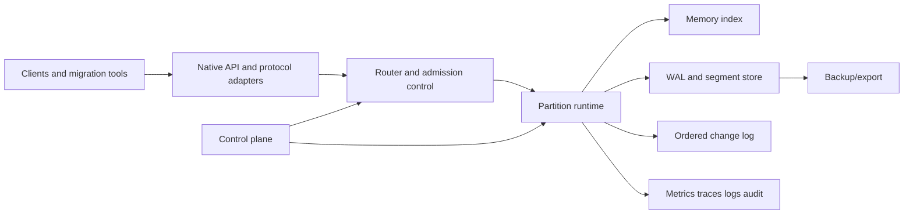

# Technical Requirements Document

**Version:** 0.1 · **Status:** Proposed / architecture discovery · **Date:** 2026-09-24

Related: [BRD](BUSINESS_REQUIREMENTS.md) · [DDD](DOMAIN_DRIVEN_DESIGN.md) · [Validation](TRACEABILITY_AND_VALIDATION.md)

## 1. Architecture objective

Deliver an independently testable state-and-event substrate whose guarantees are explicit and whose failure behavior is observable. The architecture starts as a modular monolith/data-node binary plus a logically separate control plane. Service decomposition is justified by scaling, isolation, or lifecycle evidence—not by a microservices preference.



## 2. Design principles

- One authoritative partition commit path; derived indexes and exports cannot acknowledge ahead of it.
- Named workload profiles with finite, testable semantics.
- Separate control-plane availability from data-plane behavior.
- Deterministic state machines and injectable clocks/failures for tests.
- Stable IDs, versioned formats, idempotent commands, and resumable workflows.
- Safe defaults: encrypted transport, authentication required, deny-by-default authorization, bounded resources.

## 3. Workload profiles

| Profile   | Intended use                         | Acknowledgement                                                 | Recovery expectation                                     |
| --------- | ------------------------------------ | --------------------------------------------------------------- | -------------------------------------------------------- |
| `cache`   | Reconstructible low-latency state    | Primary memory acceptance; replication optional/configured      | Loss is possible and explicitly bounded by configuration |
| `durable` | Stateful application data and events | WAL durability plus replica quorum under the qualified topology | No acknowledged loss within the tested fault model       |
| `strong`  | Linearizable conditional state       | Consensus commit by partition group                             | Gated until formal semantics and fault tests pass        |

Profiles are namespace-level in MVP. Per-key policies, causal consistency, CRDTs, and active-active writes are deferred because their composition and operator burden are substantial.

## 4. Components

### 4.1 API edge

- Native versioned gRPC API; optional REST administration API.
- Redis RESP and Kafka protocol adapters implement declared subsets only.
- Authentication, authorization context, request size limits, quotas, deadlines, idempotency keys, and trace propagation.
- Stable error taxonomy: invalid, unauthorized, conflict, throttled, unavailable, deadline, unsupported, and indeterminate.

### 4.2 Metadata and control plane

- Authoritative desired state for clusters, nodes, tenants, namespaces, policies, partitions, releases, backups, and operations.
- Consensus-backed metadata group with fencing tokens for mutating controllers.
- Declarative reconciliation; every long-running operation has an ID, state machine, progress, cancellation rules, and audit history.
- The data plane continues according to its last valid configuration during temporary control-plane loss.

### 4.3 Partition runtime

- Fixed virtual partitions mapped to replication groups; placement is zone/rack aware.
- Epoch and leader/fencing checks prevent stale owners from accepting writes.
- Per-partition serialized commit ordering initially; parallelism occurs across partitions.
- Reconfiguration uses snapshot transfer plus incremental catch-up, then an atomic ownership transition.
- Hot-partition detection reports key/tenant contributors using privacy-bounded sampling.

### 4.4 Storage

- Memory-resident primary index for the qualified hot path.
- Checksummed, append-only WAL/segments on local durable media.
- Manifest records segment set, format version, high-water marks, and snapshot lineage.
- Background compaction is rate-limited and exposes amplification, debt, and latency impact.
- Crash recovery replays only validated records after the last valid checkpoint.
- Object storage is backup/export first; transparent cold reads are post-MVP.

### 4.5 State and log integration

Within one partition, a transaction record includes state mutations, optional change records, producer identity/sequence, and commit metadata. Commit makes the state version and log offset visible together. Consumers remain at-least-once by default; producer deduplication and transactional offset advancement can provide exactly-once effects only inside the defined boundary. Documentation must not generalize this to arbitrary external side effects.

### 4.6 Query and graph extensions

Not MVP. Extensions consume versioned partition snapshots/change streams and declare freshness. A future graph service may store adjacency lists colocated by vertex partition; cross-partition traversal requires budgets, continuation tokens, and partial-result semantics. SQL requires an explicit supported grammar and consistency model.

## 5. Technical requirements

| ID         | Requirement                                                                                                                                                         | Maps to        |
| ---------- | ------------------------------------------------------------------------------------------------------------------------------------------------------------------- | -------------- |
| UDP-TR-001 | Every acknowledged mutation shall be associated with namespace, partition, epoch, commit position, and profile outcome.                                             | BR-002, BR-003 |
| UDP-TR-002 | State mutation and its enabled partition-local change record shall commit atomically.                                                                               | BR-003         |
| UDP-TR-003 | Retries with the same producer/idempotency identity shall not create additional committed mutations within the retention window.                                    | BR-003         |
| UDP-TR-004 | Partition ownership changes shall use epochs/fencing and shall reject stale writers.                                                                                | BR-002, BR-012 |
| UDP-TR-005 | Recovery shall validate checksums, manifests, and monotonic commit positions before serving.                                                                        | BR-002, BR-008 |
| UDP-TR-006 | Backup artifacts shall be encrypted, checksummed, catalogued, restorable to an isolated target, and tied to an evidenced recovery point.                            | BR-008         |
| UDP-TR-007 | Controllers shall be idempotent and resumable after process loss.                                                                                                   | BR-004         |
| UDP-TR-008 | Rebalance and upgrade plans shall expose predicted movement, risk, compatibility, and abort boundaries before execution.                                            | BR-004, BR-011 |
| UDP-TR-009 | Each protocol adapter shall be versioned against an executable compatibility corpus.                                                                                | BR-006         |
| UDP-TR-010 | Unsupported commands, options, or semantics shall return explicit errors rather than approximate silently.                                                          | BR-006         |
| UDP-TR-011 | Tenant and namespace authorization shall be enforced at API and internal service boundaries.                                                                        | BR-007         |
| UDP-TR-012 | Secrets shall use an external secret provider or encrypted store and support rotation without plaintext logging.                                                    | BR-007         |
| UDP-TR-013 | Audit events shall be append-only, integrity-protected, queryable, and exportable under retention policy.                                                           | BR-007, BR-014 |
| UDP-TR-014 | Metrics shall include request rate/errors/duration, queueing, replication lag, under-replication, storage/compaction, rebalance, recovery, and resource saturation. | BR-004, BR-012 |
| UDP-TR-015 | Health shall distinguish ready, degraded, recovering, under-replicated, policy-violating, and unknown.                                                              | BR-012         |
| UDP-TR-016 | Resource quotas and admission control shall prevent one tenant/namespace from exhausting cluster-wide memory, disk, connections, or execution slots.                | BR-005, BR-007 |
| UDP-TR-017 | Usage meters shall be deterministic, replayable, versioned, and reconcilable to invoices/estimates.                                                                 | BR-005         |
| UDP-TR-018 | All persisted and transmitted schemas/formats shall carry versions with forward/backward compatibility rules and migration tests.                                   | BR-011, BR-014 |
| UDP-TR-019 | The benchmark harness shall capture environment, topology, data, workload, warmup, duration, percentiles, errors, recovery, and cost inputs.                        | BR-010         |
| UDP-TR-020 | The local runtime shall use the same logical APIs and formats while clearly reporting unsupported distributed behaviors.                                            | BR-001, BR-009 |
| UDP-TR-021 | Export and deletion jobs shall be asynchronous, idempotent, authorized, audited, and produce completion evidence.                                                   | BR-014         |
| UDP-TR-022 | Console flows shall support keyboard navigation, non-color status, 200% zoom, and programmatic labels.                                                              | BR-015         |

## 6. API sketch

```proto
service StateService {
  rpc Get(GetRequest) returns (GetResponse);
  rpc Put(PutRequest) returns (MutationResponse);
  rpc Delete(DeleteRequest) returns (MutationResponse);
  rpc CompareAndSet(CompareAndSetRequest) returns (MutationResponse);
  rpc Batch(BatchRequest) returns (BatchResponse); // one partition in MVP
}

message MutationResponse {
  string namespace_id = 1;
  uint32 partition_id = 2;
  uint64 epoch = 3;
  uint64 commit_position = 4;
  string durability_profile = 5;
  bool deduplicated = 6;
}
```

Stream APIs cover append, fetch, consumer-group join/heartbeat, offset commit, and retention administration. API specifications must define ordering, size limits, timeouts, partial failure, cancellation, and retry safety.

## 7. Security and privacy

- Workload identity via mTLS and/or short-lived OIDC tokens; human control-plane access via federated OIDC.
- RBAC scoped by organization, project, cluster, namespace, and operation; policy engine decisions are auditable.
- TLS in transit and envelope encryption at rest; key identifiers and rotation state are metadata, not secrets.
- Network policies separate public/API, management, replication, and storage traffic.
- Threat model covers tenant escape, confused deputy, stale leader, replay, protocol parser abuse, backup theft, supply chain, and control-plane compromise.
- Data classification, residency, retention, deletion, and telemetry minimization are configurable. “SOC 2/GDPR/HIPAA compliant” is prohibited without applicable assessment and organizational controls.

## 8. Reliability and operations

Required runbooks: node loss, zone loss, control-plane loss, disk exhaustion, corruption/checksum failure, replica divergence, hot partition, certificate expiry, failed upgrade, failed rebalance, backup failure, restore, and suspected credential compromise.

Every runbook specifies detection, impact by workload profile, safe containment, recovery, verification, rollback, and evidence retained.

## 9. Performance validation

No latency or throughput number is a requirement until a baseline environment is approved. Qualification includes:

- KV read-heavy, write-heavy, mixed, TTL churn, hot-key, and bounded-batch workloads.
- Log producer/consumer throughput, many partitions, consumer churn, retention, compaction, and replay.
- State-plus-change atomic path.
- Steady state and saturation; p50/p95/p99/p99.9; errors and timeouts.
- Node/zone failure, leader change, snapshot, compaction, rebalance, upgrade, backup, and restore while loaded.
- Comparison only against documented, equivalently durable/configured competitor modes.

## 10. Delivery slices

1. Deterministic single-node engine, WAL, recovery, native API, local tooling.
2. Partition replication, metadata consensus, fencing, fault harness.
3. Change log, consumers, state-change atomicity, deduplication.
4. Control-plane workflows, observability, backup/restore, Kubernetes packaging.
5. Security/isolation and declared Redis compatibility subset.
6. Declared Kafka subset and migration tooling, if G1–G3 pass.
